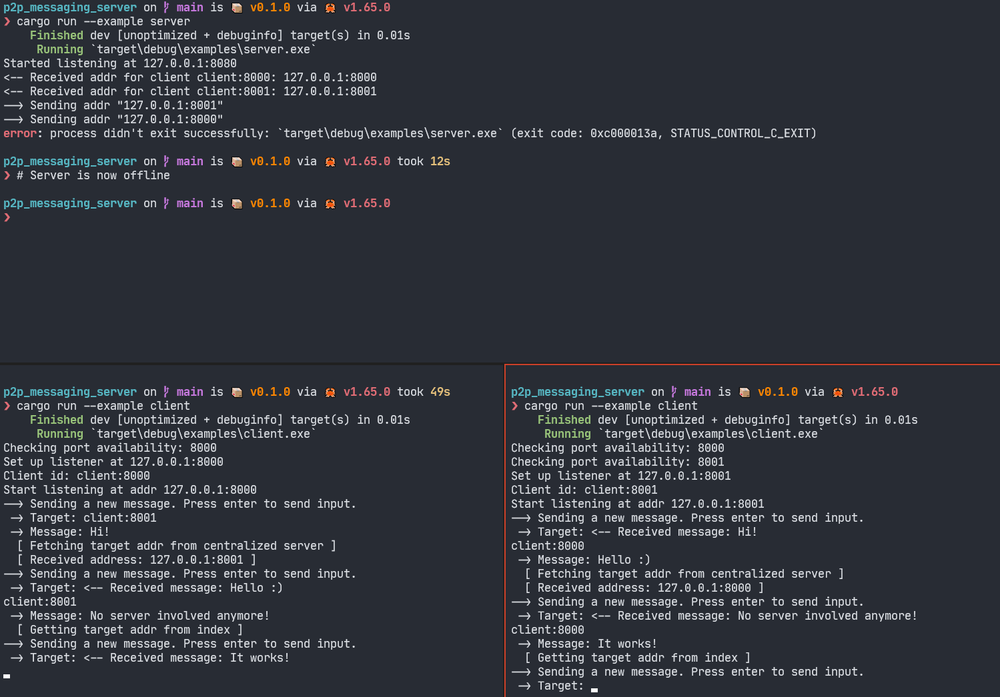

# p2p_messaging

## Running the example

In one terminal:

```sh
cargo run --example server
```

In multiple other terminals:

```sh
cargo run --example client
```

## Introduction

This is a very crude implementation of a naive P2P system, which uses a centralized server to fetch addresses, which are then stored in the clients.

The server spins up, and waits for requests, which can be client broadcasts (name + address) or address requests.

The client first asks for a target, and fetches its address from the centralized server if it's not already known. The clients can then exchange messages freely without interacting with the centralized server.

## Implementation details

Everything is done with the standard library, using no external dependencies. I kind of regretted having no serialization framework (`serde` for example) when writing and parsing the buffers by hand 😄

I should probably have written a better visualization but I wanted to keep the exercise short. Right now the messages are written on the same line as the input prompts, which is obviously ugly and not very readable.

## Limitations of the solution

- There is no disconnection mechanism, meaning that if a client disconnects, no one is actually notified.
- There is no replication mechanisms for the server, meaning that it's not possible to have multiple centralized servers existing at the same time, which would result in a bottleneck in case of heavy load situations.
- The current solution is completely blocking and non-async, which would result in a lot of wasted time waiting for writes/reads if there was a considerable amount of simultaneous users. I went with this implementation because I wanted to keep the code as basic as possible.
- The current centralized server can probably handle ~100 simultaneous address fetch requests considering how simple the protocol is and how fast the parsing/writing is. But it's a complete guess.
- IPv6 addresses are not handled because I ran out of time (even though it's probably a 2 minutes fix).
- The components assume that the protocol will be valid which will result in a client or server disconnecting most of the time if the protocol isn't respected.
- Attack surface: even though it's Rust and no `unsafe` is used anywhere, the protocol itself is extremely bad. One thing I wish I had the time to add was simple checksums at the end of requests to have a way of verifying that a wrong request is somewhat intended or not.

## Questions

> What are the limitations of this solution? Are there cases where your service will not work?

Listed above.

> Does your system scale? Where is the bottleneck? How many users can it support?

The bottleneck is the centralized server, which could probably hold ~100 concurrent address fetch requests continuously given the rapidity and simplicity of the exchanges.

> What is the attack surface on the system? How could you reduce it?

Everything is sent over TCP which means no TLS encryption for example. There is no Diffie-Hellman agreement or anything like this, which could be integrated to create some client-to-client encryption.

The solution uses rust, but given the simple nature of the protocol (and the fact that everything is hand-parsed), there might be logic errors in there!

> Compatibility: which OS/browsers/systems is our service compatible with?

It can be compiled on any target supported by the rust toolchains. It can also be compiled to WebAssembly which means that we can more or less execute it anywhere (that supports it 😉), although direct TCP connections might not be that easy to do in WebAssembly.

## Closing thoughts

Overall the implementation is very basic, very naive, and fragile. It was my first time doing somewhat low-level networking with Rust, which turned out OK in my opinion. I should definitely have read a little bit about the subject before implementing my "own" solution, and should definitely have used some external dependencies, at least for the serialization, but an async executor such as `tokio` would have made everything better.

It was also my first time doing P2P networking, but my solution is so naive and simple that it doesn't really feel like P2P networking (even though clients can indeed communicate without the need for the centralized server when they got the addresses they need).

I would have loved to have an auto-discovery feature so that clients automatically fetch peers as they become available. I would also have loved to have a way for nodes to fetch and add addresses from other nodes, which would make the centralized server less important, allowing a network of nodes to infinitely run on its own. Basically I would have loved to start with the idea that nodes embed the centralized server's functionalities. With this it would have looked like a real P2P protocol!

## Screenshot


